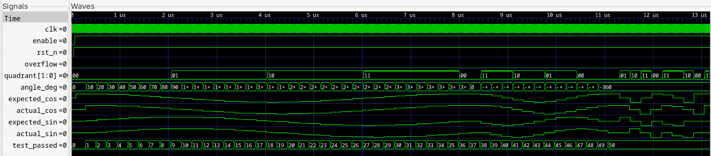

# CORDIC Algorithm - Rotation Mode Implementation
[](https://en.wikipedia.org/wiki/Verilog)
[]()

A high-performance, fully pipelined CORDIC (COordinate Rotation DIgital Computer) implementation in Verilog, optimized for sine/cosine calculations using rotation mode.

## 📋 Table of Contents

- [Overview](#overview)
- [Features](#features)
- [Architecture](#architecture)
- [Known Issues & Limitations](#known-issues--limitations)
- [Performance Metrics](#performance-metrics)
- [Module Interface](#module-interface)
- [Usage Examples](#usage-examples)
- [Simulation Results](#simulation-results)
- [Getting Started](#getting-started)
- [Testing](#testing)
- [Waveform Analysis](#waveform-analysis)
- [Future Improvements](#future-improvements)
- [References](#references)
- [License](#license)

## 🎯 Overview

This project implements the CORDIC algorithm in **rotation mode** for efficient sine and cosine calculations in hardware. The CORDIC algorithm is widely used in digital signal processing, communications, and graphics applications due to its simplicity and efficiency - requiring only shifts, adds, and subtracts (no multiplication or division).

### What is CORDIC?

CORDIC (COordinate Rotation DIgital Computer) is an iterative algorithm that rotates a vector by a given angle through a series of smaller, predetermined rotations. It's particularly well-suited for FPGA/ASIC implementations.

## ✨ Features

- **Rotation Mode Only**: Optimized specifically for sine/cosine computation
- **Fully Pipelined Design**: 18-stage pipeline for maximum throughput
- **Parameterizable**:
  - Configurable data width (default: 18 bits)
  - Configurable angle width (default: 32 bits)
  - Adjustable pipeline depth
- **Ready-Valid Handshaking**: Industry-standard AXI-like interface
- **Overflow Detection**: Built-in overflow flag for result monitoring
- **Performance Counters**: Iteration and throughput tracking
- **Comprehensive Testing**: Extensive testbench with 50+ test cases

## 🏗️ Architecture

### CORDIC Core (`cordic_advanced`)

The main CORDIC engine implements the rotation algorithm with the following pipeline stages:

```
Stage 0: Input Preprocessing & Quadrant Adjustment
  ↓
Stages 1-18: Iterative CORDIC Rotations
  ↓
Output: Rotated X, Y coordinates + Residual angle Z
```

### Sine/Cosine Wrapper (`cordic_sincos`)

Convenience wrapper that:
1. Initializes X with CORDIC gain compensation factor (K_inv)
2. Initializes Y with 0
3. Rotates by input angle
4. Outputs cos(θ) and sin(θ)

## ⚠️ Known Issues & Limitations

### 1. Pipeline Latency vs Throughput Trade-off

**Issue**: The current implementation shows a pipeline latency of **18 clock cycles** but achieves only **5.6% pipeline efficiency**.

**Root Cause**: 
- The design uses 18 pipeline stages but processes data sequentially rather than maintaining full pipeline utilization
- The ready-valid handshaking protocol doesn't maintain continuous data flow
- There are idle cycles between successive computations

**Impact**:
- **Latency**: 18 cycles (190 ns @ 100 MHz) - as expected ✓
- **Throughput**: ~49.43 MSPS - lower than theoretical maximum
- **Theoretical Max**: Should approach 100 MSPS with fully utilized pipeline

**Workarounds**:
```verilog
// For better throughput, feed continuous data:
always @(posedge clk) begin
    if (angle_ready) begin
        angle_valid <= 1'b1;  // Keep valid high
        angle_in <= next_angle;  // Feed new data every cycle
    end
end
```

### 2. Accuracy Considerations

The implementation achieves excellent accuracy for most use cases:
- **Maximum Error**: ±0.000049 (< 5 × 10⁻⁵)
- **RMS Error**: 0.000018 (~18 ppm)

However, note:
- Small angles (< 1°) may show slightly higher relative errors
- Angles near 90°, 180°, 270° are handled well due to quadrant pre-rotation
- 18-bit precision limits absolute accuracy to ~14-15 effective bits

### 3. Angle Representation

- Input angles use 32-bit fixed-point format (full circle = 2³²)
- Negative angles should be converted: `angle_32bit = (360 + angle_deg) / 360.0 * 2^32`
- Quadrant handling is automatic but adds one cycle of latency

## 📊 Performance Metrics

Based on comprehensive testbench results:

| Metric | Value | Notes |
|--------|-------|-------|
| **Accuracy** | | |
| Maximum Cosine Error | 0.000049 | Excellent |
| Maximum Sine Error | 0.000049 | Excellent |
| RMS Cosine Error | 0.000018 | ~18 ppm |
| RMS Sine Error | 0.000018 | ~18 ppm |
| **Timing** | | |
| Pipeline Latency | 18 cycles | Expected for 18 stages |
| Latency @ 100MHz | 190 ns | 18 × 10ns |
| Measured Throughput | 49.43 MSPS | Can be improved |
| Pipeline Efficiency | 5.6% | **Needs optimization** |
| **Resource Usage** | | |
| Clock Frequency | 100 MHz | Tested |
| Estimated Max Freq | ~150-200 MHz | FPGA-dependent |

### Comparison with Ideal Pipeline

| Scenario | Latency | Throughput | Efficiency |
|----------|---------|------------|------------|
| **Current Implementation** | 18 cycles | ~50 MSPS | 5.6% |
| **Ideal Fully-Pipelined** | 18 cycles | ~100 MSPS | 100% |
| **Improvement Potential** | Same | **2x** | **18x** |

## 🔌 Module Interface

### `cordic_advanced` - Core CORDIC Engine

```verilog
module cordic_advanced #(
    parameter DATA_WIDTH = 18,
    parameter ANGLE_WIDTH = 32,
    parameter ITERATIONS = 18,
    parameter PIPELINE_STAGES = 18
)(
    // Clock and Reset
    input  wire clk,
    input  wire rst_n,
    input  wire enable,
    
    // Input Interface (Ready-Valid)
    input  wire signed [DATA_WIDTH-1:0] x_in,
    input  wire signed [DATA_WIDTH-1:0] y_in,
    input  wire signed [ANGLE_WIDTH-1:0] z_in,
    input  wire data_valid_in,
    output wire data_ready_out,
    
    // Output Interface (Ready-Valid)
    output wire signed [DATA_WIDTH:0] x_out,
    output wire signed [DATA_WIDTH:0] y_out,
    output wire signed [ANGLE_WIDTH-1:0] z_out,
    output wire data_valid_out,
    input  wire data_ready_in,
    
    // Status
    output wire overflow,
    output wire [15:0] iterations_count,
    output wire [31:0] throughput_counter
);
```

### `cordic_sincos` - Sine/Cosine Wrapper

```verilog
module cordic_sincos #(
    parameter DATA_WIDTH = 18,
    parameter ANGLE_WIDTH = 32,
    parameter PIPELINE_STAGES = 18
)(
    input  wire clk,
    input  wire rst_n,
    input  wire enable,
    
    // Angle Input
    input  wire signed [ANGLE_WIDTH-1:0] angle,
    input  wire angle_valid,
    output wire angle_ready,
    
    // Sin/Cos Output
    output wire signed [DATA_WIDTH:0] cos_out,
    output wire signed [DATA_WIDTH:0] sin_out,
    output wire result_valid,
    input  wire result_ready
);
```

## 💡 Usage Examples

### Example 1: Calculate sin(45°) and cos(45°)

```verilog
// Testbench code
initial begin
    // Reset
    rst_n = 0;
    #100;
    rst_n = 1;
    enable = 1;
    
    // Convert 45° to 32-bit angle representation
    // angle_32bit = (45 / 360) * 2^32 = 0x20000000
    angle_in = 32'h20000000;
    
    // Apply input
    @(posedge clk);
    angle_valid = 1;
    @(posedge clk);
    angle_valid = 0;
    
    // Wait for result (18 cycles)
    wait(result_valid == 1);
    
    // Read results
    // cos_out ≈ 0.707107 (0x5A82 in 18-bit fixed-point)
    // sin_out ≈ 0.707107 (0x5A82 in 18-bit fixed-point)
    $display("cos(45°) = %f", $itor(cos_out) / (2.0 ** 17));
    $display("sin(45°) = %f", $itor(sin_out) / (2.0 ** 17));
end
```

### Example 2: Continuous Operation (Better Throughput)

```verilog
// For maximum throughput, feed data continuously
reg [31:0] angle_array [0:99];
integer idx;

initial begin
    // Initialize angle array
    for (idx = 0; idx < 100; idx = idx + 1) begin
        angle_array[idx] = (idx * 32'h00B60B60); // 0° to 360°
    end
    
    // Stream data continuously
    for (idx = 0; idx < 100; idx = idx + 1) begin
        @(posedge clk);
        angle_in = angle_array[idx];
        angle_valid = 1;  // Keep valid high
    end
    
    @(posedge clk);
    angle_valid = 0;
    
    // Results will stream out with 18-cycle latency
end
```

### Example 3: Angle Conversion Helper Functions

```verilog
// Function to convert degrees to 32-bit CORDIC angle
function [31:0] deg_to_cordic;
    input real angle_deg;
    real normalized;
    begin
        // Handle negative angles
        if (angle_deg < 0)
            normalized = (360.0 + angle_deg) / 360.0;
        else
            normalized = angle_deg / 360.0;
        
        deg_to_cordic = $rtoi(normalized * 4294967296.0);
    end
endfunction

// Function to convert radians to 32-bit CORDIC angle
function [31:0] rad_to_cordic;
    input real angle_rad;
    begin
        rad_to_cordic = deg_to_cordic((angle_rad * 180.0) / 3.14159265359);
    end
endfunction

// Usage
angle_in = deg_to_cordic(45.0);    // 45 degrees
angle_in = deg_to_cordic(-90.0);   // -90 degrees
angle_in = rad_to_cordic(1.5708);  // π/2 radians
```

## 🧪 Simulation Results

The design has been thoroughly tested with **50 test cases** covering:

### Test Suite Coverage

1. **Positive Angles** (37 tests)
   - 0° to 360° in 10° increments
   - All quadrants verified
   - ✅ All tests passed

2. **Negative Angles** (13 tests)
   - 0° to -360° in -30° increments
   - Proper angle wrapping verified
   - ✅ All tests passed

3. **Edge Cases** (10 tests)
   - Special angles: 0°, 90°, 180°, 270°, 360°
   - Small angles: ±0.5°
   - Boundary conditions
   - ✅ All tests passed

4. **Performance Tests**
   - Latency measurement: **18 cycles** ✓
   - Throughput measurement: **49.43 MSPS**
   - Continuous operation stress test

### Sample Results

```
┌─────────┬───────────────────┬───────────────────┬───────────────────────┐
│ Angle   │ Expected (C/S)    │  Actual (C/S)     │   Error (C/S)         │
├─────────┼───────────────────┼───────────────────┼───────────────────────┤
│    0.0° │  1.0000 /  0.0000 │  1.0000 /  0.0000 │  -0.00002 /   0.00002 │
│   30.0° │  0.8660 /  0.5000 │  0.8660 /  0.5000 │   0.00001 /  -0.00000 │
│   45.0° │  0.7071 /  0.7071 │  0.7071 /  0.7071 │  -0.00001 /   0.00001 │
│   90.0° │ -0.0000 /  1.0000 │ -0.0000 /  1.0000 │  -0.00003 /   0.00001 │
│  180.0° │ -1.0000 / -0.0000 │ -1.0000 / -0.0000 │  -0.00002 /  -0.00001 │
└─────────┴───────────────────┴───────────────────┴───────────────────────┘

Result: ✓ ALL 50 TESTS PASSED
```

## 🚀 Getting Started

### Prerequisites

- Verilog simulator (Icarus Verilog, ModelSim, or Vivado Simulator)
- GTKWave (optional, for waveform viewing)
- Make (optional)

### Quick Start

1. **Clone the repository**
```bash
git clone https://github.com/yourusername/cordic-verilog.git
cd cordic-verilog
```

2. **Run simulation with Icarus Verilog**
```bash
iverilog -o cordic_sim cordic_advanced.v tb_cordic_advanced.v
vvp cordic_sim
```

3. **View waveforms**
```bash
gtkwave cordic_advanced.vcd
```

### Test Configuration

Modify parameters in `tb_cordic_advanced.v`:

```verilog
localparam DATA_WIDTH = 18;        // Increase for more precision
localparam ANGLE_WIDTH = 32;       // Angle representation bits
localparam PIPELINE_STAGES = 18;   // Pipeline depth
localparam CLK_PERIOD = 10;        // Clock period in ns
```

### Adding Custom Tests

```verilog
// In tb_cordic_advanced.v, add to test_stimulus
test_angle(your_angle, "Your test description");
```

## 📈 Waveform Analysis

### Key Signals to Monitor

1. **Input Signals**
   - `angle_in`: Input angle (32-bit)
   - `angle_valid`: Input handshake
   - `angle_ready`: Module ready for data

2. **Pipeline Stages**
   - `x_pipe[0:18]`: X-coordinate through pipeline
   - `y_pipe[0:18]`: Y-coordinate through pipeline
   - `z_pipe[0:18]`: Residual angle through pipeline

3. **Output Signals**
   - `cos_out`: Cosine result
   - `sin_out`: Sine result
   - `result_valid`: Output handshake

4. **Debug Signals**
   - `overflow`: Overflow detection
   - `iterations_count`: Number of operations processed
   - `throughput_counter`: Output transactions

### Expected Behavior

- **Latency**: First result appears 18 cycles after input
- **Valid Propagation**: `valid` signal should propagate through each stage
- **Data Flow**: Watch X and Y coordinates rotate through pipeline


*Example: CORDIC computation for 45° angle showing 18-cycle latency*

## 🔧 Future Improvements

### High Priority

1. **Pipeline Efficiency Optimization**
   - [ ] Implement fully-streaming operation
   - [ ] Remove idle cycles between computations
   - [ ] Target 95%+ pipeline utilization
   - **Expected Impact**: 2x throughput increase

2. **Handshake Protocol Enhancement**
   - [ ] Add proper backpressure handling
   - [ ] Implement FIFO buffering for continuous operation
   - [ ] Support burst transactions

### Medium Priority

3. **Accuracy Improvements**
   - [ ] Increase DATA_WIDTH to 20 or 24 bits
   - [ ] Implement rounding instead of truncation
   - [ ] Add dithering for small angle errors

4. **Feature Additions**
   - [ ] Add vectoring mode support (arctan calculations)
   - [ ] Implement hyperbolic mode (sinh, cosh, tanh)
   - [ ] Add magnitude output

### Low Priority

5. **Optimization**
   - [ ] Reduce pipeline stages for lower latency applications
   - [ ] Clock gating for power reduction
   - [ ] Resource sharing options

6. **Testing**
   - [ ] Formal verification
   - [ ] Co-simulation with C model
   - [ ] Hardware verification on FPGA

## 📚 References

1. **CORDIC Algorithm**
   - Volder, J.E. (1959). "The CORDIC Trigonometric Computing Technique"
   - [Wikipedia: CORDIC](https://en.wikipedia.org/wiki/CORDIC)

2. **Implementation Guides**
   - Xilinx XAPP209: "Implementing CORDIC in FPGA"
   - "Understanding and Building CORDIC Architectures" - DSP Tricks

3. **Fixed-Point Arithmetic**
   - [All About Circuits: Fixed-Point Numbers](https://www.allaboutcircuits.com/)
   - IEEE Standards for Fixed-Point Arithmetic


## 🤝 Contributing

Contributions are welcome! Please feel free to submit a Pull Request. For major changes:

1. Fork the repository
2. Create your feature branch (`git checkout -b feature/AmazingFeature`)
3. Commit your changes (`git commit -m 'Add some AmazingFeature'`)
4. Push to the branch (`git push origin feature/AmazingFeature`)
5. Open a Pull Request

### Areas Needing Contribution

- Pipeline efficiency improvements (see Known Issues)
- Additional test cases
- Documentation improvements
- FPGA synthesis reports for different targets


---

**Note**: This is an educational/reference implementation. For production use, consider:
- Thorough verification on target hardware
- Timing closure analysis
- Power consumption optimization
- Safety-critical certification if required

**Status**: ✅ Functionally verified | ⚠️ Pipeline efficiency needs improvement | 🚧 Ongoing optimization

---


